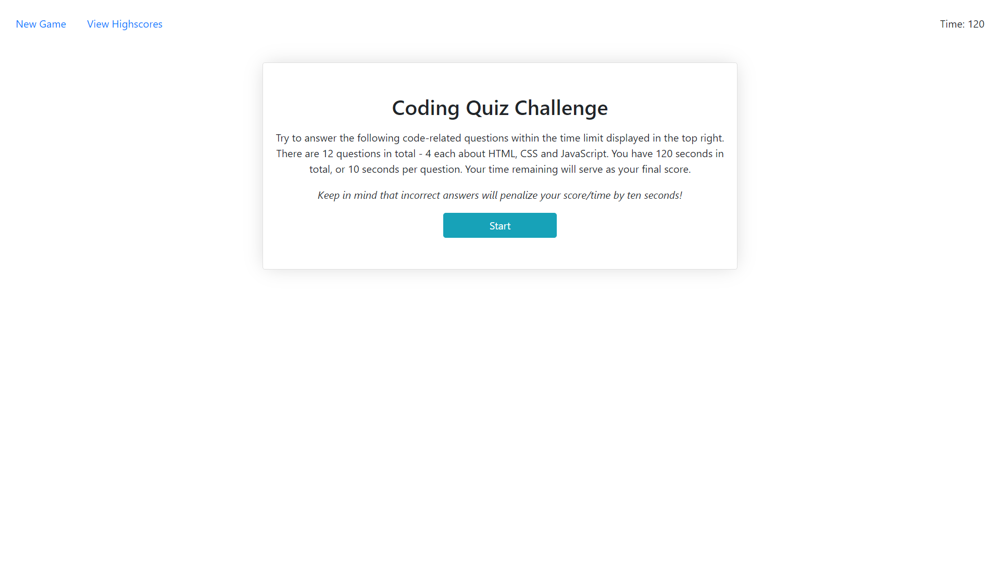
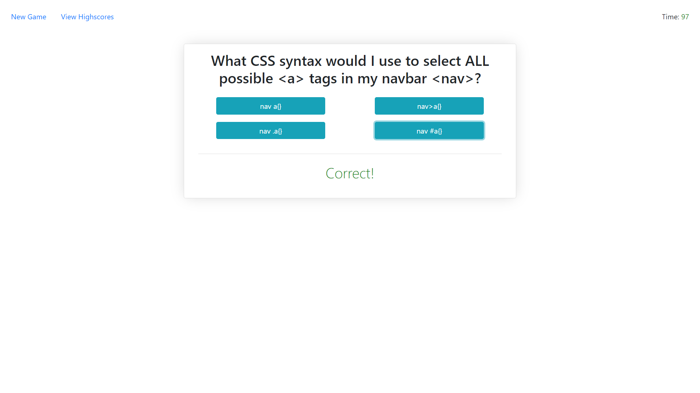
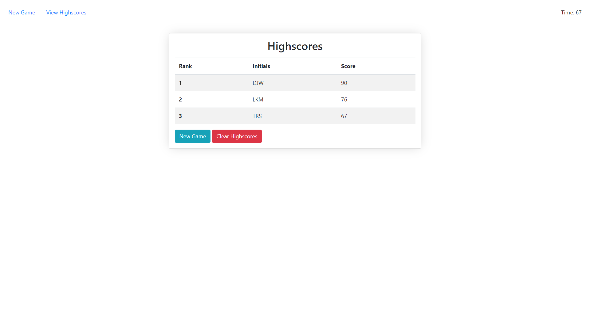

# CodeQuiz

A simple quiz game about coding built using HTML, CSS (Bootstrap), vanilla JS and local storage.
This was a much more complicated project than the previous ones for the course and included semi-persistent
data via local storage.

I wrote the application so everything rendered to a single page, and relied almost entirely on Bootstrap for CSS,
which saved me a lot of time.

I feel my code could probably use better organization and perhaps also be refactored
to be a bit more concise, but compromises have to be made with a due date. Everything works how it should so that
is a victory!

Additional features/improvents which could be cool include:

- Ability to delete individual high scores
- Confirmation for deleting all high scores.
- Highscore table sorting
- Random question order
- Random answer order for each question
- Better card design for questions
- Ability to select number of questions at start
- Progress indicator (ie. "Question 1/15")

### Project is demo'd here:

https://derek-watson14.github.io/CodeQuiz/

### Screenshots:

Start page that the user first sees.

Sample of gameplay. The "Correct" refers to the previous question.

High score submission form.

Highscore table allowing users to play again or clear highscores.
